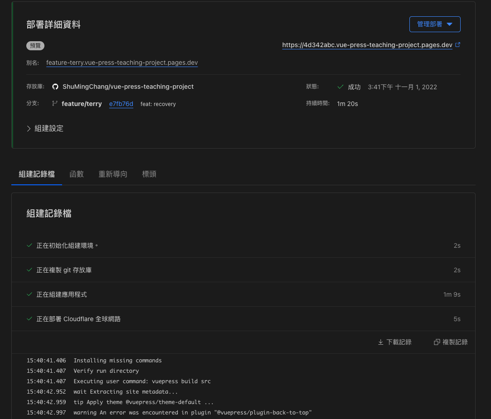
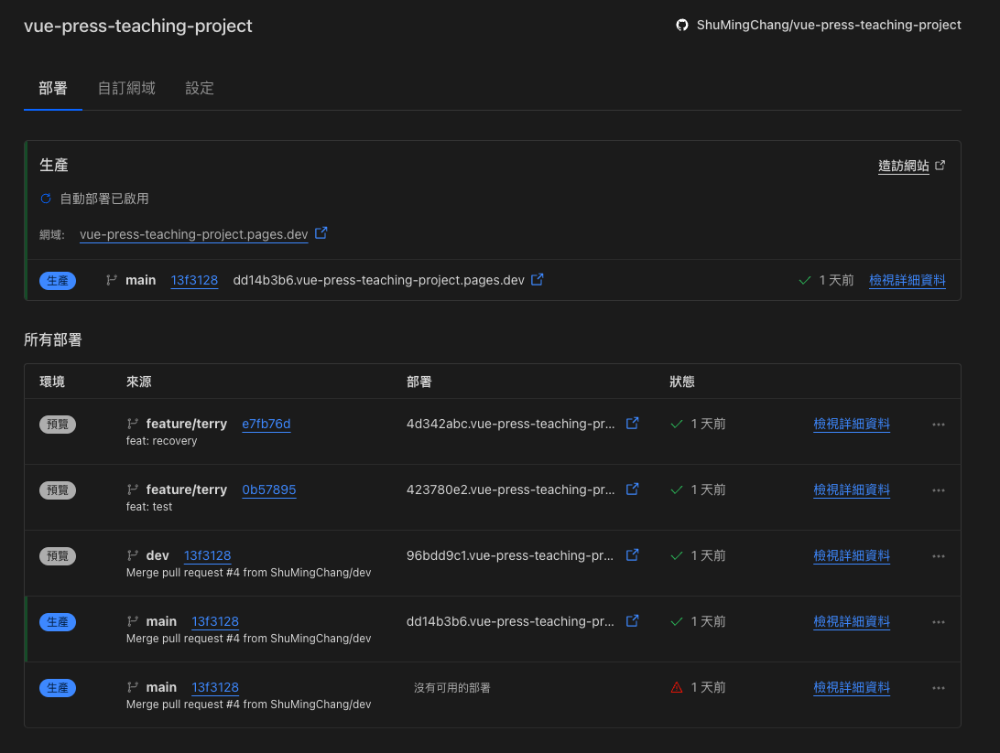
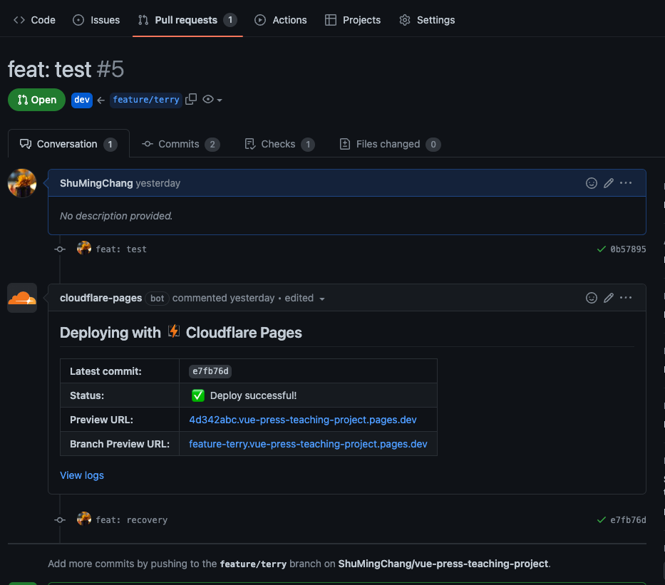

# Cloudflare Pages

> Cloudflare Pages is a JAMstack platform for frontend developers to **collaborate** and deploy websites.

## The power of Cloudflare Pages 

### 自動化流程

近年來的 DevOps 相關領域蓬勃發展，衍生出很多持續整合和持續部署相關的工具，Cloudflare Pages就是整合的很好的相關雲端服務，讓我們可以很簡單的打造出可靠的自動化流程。

### 新服務帶來的團隊工作流程進步

**預覽環境的部署**🔥🔥🔥🔥🔥🔥

傳統的開發，常會侷限在各個開發環境，而且在團隊協同合作的狀態下，也常會有資源搶奪的問題，而新的架構與服務，讓我們有了更好的工作流程，讓我們輕鬆的降低溝通成本，並可以對問題更即時的反應。

### 專注焦點

好的工具可以讓我們更專注在我們更需要在意的地方，畢竟時間與資源都是有限的，以前端來說，有了工具輔助之後，我們可以更關注在使用者體驗，寫出華麗合理且順暢ＵＩ介面，調試出更快反應的頁面。

::: tip DX (Development Experience)
畢竟有好的開發者體驗也才能更容易的創造出好的使用者體驗啊😏
:::
