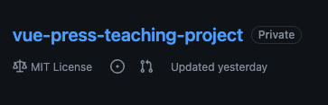
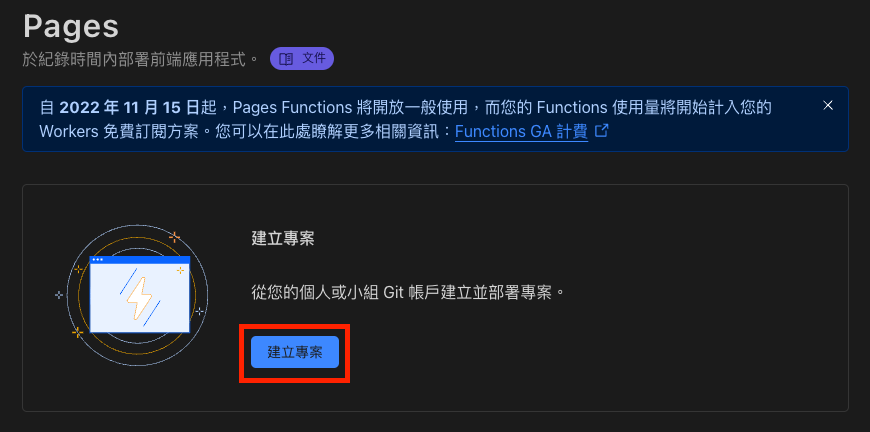
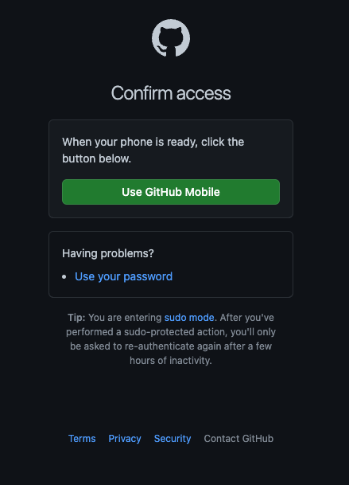
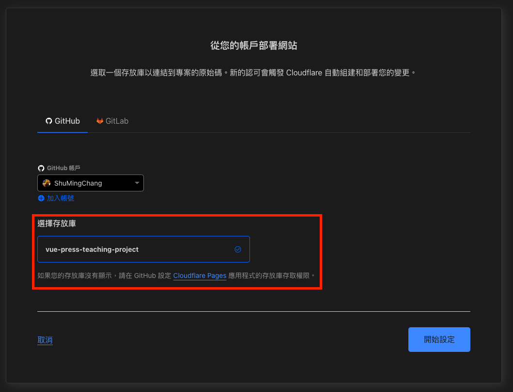
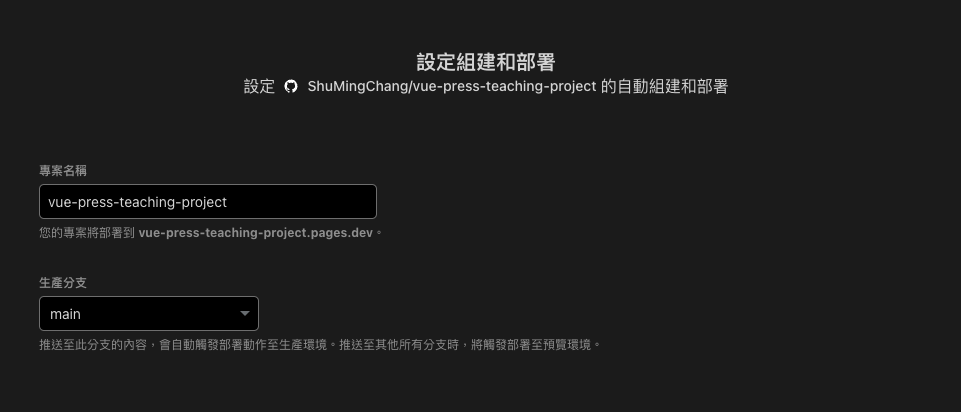
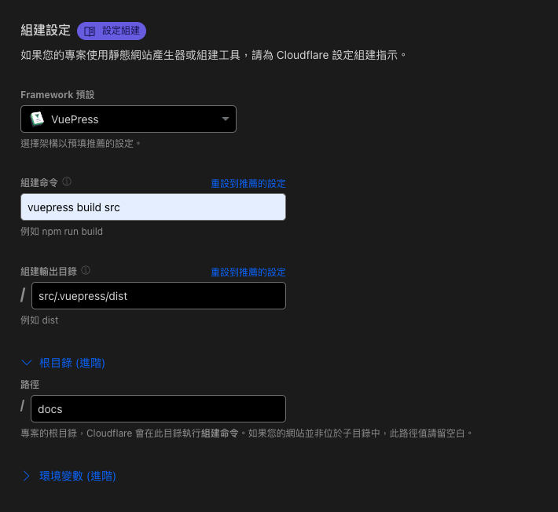
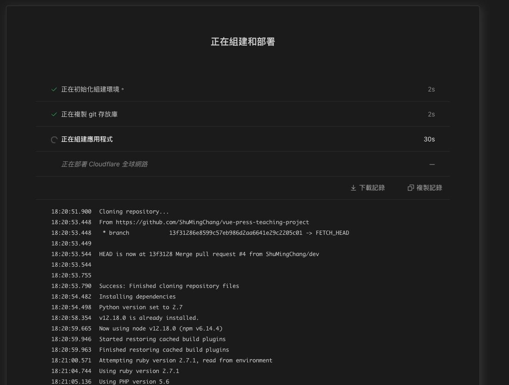
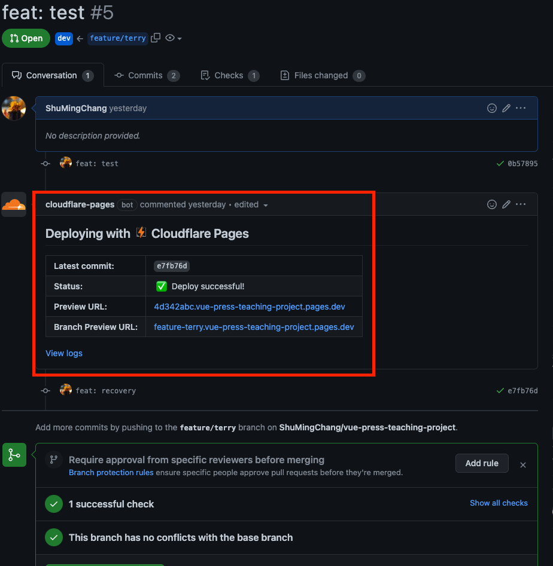

# Cloudflare Pages 設定指引

## Step 1 環境準備

在開始設定環境之前請先準備相關服務的帳號

- [Github](https://github.com/)
- [Cloudflares](https://www.cloudflare.com/zh-tw/)

並建立服務的repository

## Step 2 專案連結

進入 Cloudflare 的 dashbord 至 pages

建立專案

連線至Git

加入帳號

OAuth認證

設定permissions， **select repositories** 選擇要部署的專案

選擇存放庫（會亮起來）

設定生產分支(這個就是production了)

調整組建設定
- Framework 選對應的
- 組建命令就是打包指令
- 輸出目錄
- 還有根目錄 vuepress 預設根目錄是 docs
 

接下來服務就會自動部署了

## Step 3 檢查成果

接下來在分支發個pr，檢查 Cloudflare bot 有沒有通知你，就知道有沒有設定成功拉。

🎉🎉