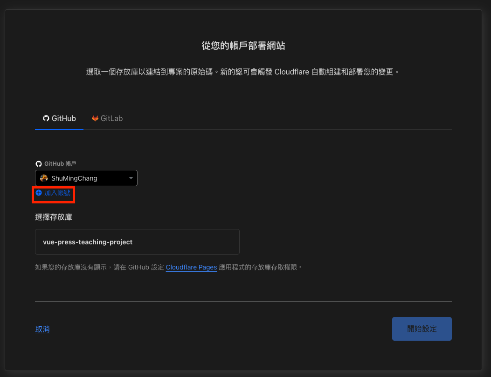
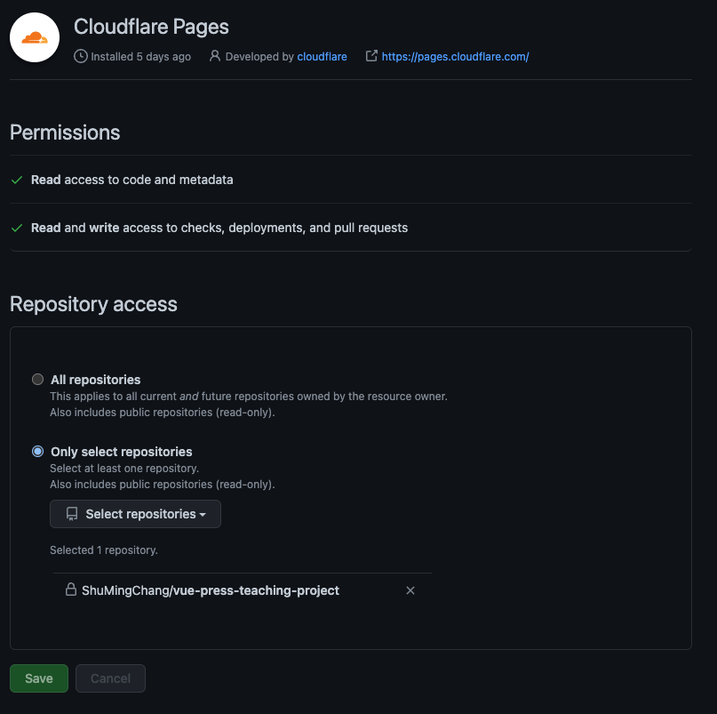

# Cloudflare Pages 設定指引

## Step 1 環境準備

在開始設定環境之前請先準備相關服務的帳號

- [Github](https://github.com/)
- [Cloudflares](https://www.cloudflare.com/zh-tw/)

並建立服務的repository

## Step 2 專案連結

進入 Cloudflare 的 dashbord 至 pages

")

 

::: tip
- Framework預設：Framework 選對應的
- 組建命令：就是打包指令
- 組建輸出目錄：build後輸出目錄
- 根目錄：vuepress 預設根目錄是 docs
:::

 

## Step 3 檢查成果

接下來在分支發個pr，檢查 Cloudflare bot 有沒有通知你，就知道有沒有設定成功拉。

🎉🎉