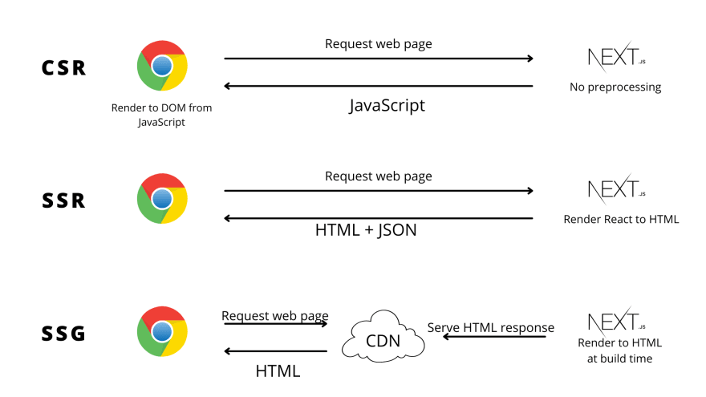

# CSR vs SSR vs SSG

## CSR (Client Site Rendering)

使用者端渲染，從伺服器端接收到空的html頁面，然後用javascript渲染頁面，也是我們常見的ＳＰＡ做法。

## SSR (Server Site Rendering)

伺服器端渲染，伺服器端收到請求之後，伺服器動態的渲染請求頁面，傳回使用者端後，接下去的請求頁面會回歸SPA的做法，也就是只有**第一頁**會在伺服器渲染，後面的頁面都是使用者端渲染，這邊也和傳統的 Jsp php .net 不同，傳統的是**每一頁**都會重新請求，且都在伺服器端渲染。

## SSG (Static Site Generation)

另一種折衷的做法，利用網站產生工具，將網頁先預渲染為**靜態檔案**，請求網頁的時候，就可以直接先拿到渲染過的頁面，因為取到的頁面都是靜態檔案，所以可以將整個站存放到ＣＤＮ上面，可以很大幅度的增加存取的速度，也解了SEO或是Open Graph Protocol等等相關的問題，也很大程度地降低了伺服器的負擔。

::: warning
另因要先把頁面先渲染出來，如果網站有很多動態頁面的話，像是電子商務網站，會產出太多的靜態頁面，就不太適合使用用這個模式。
:::

## 三種模式比較示意圖

