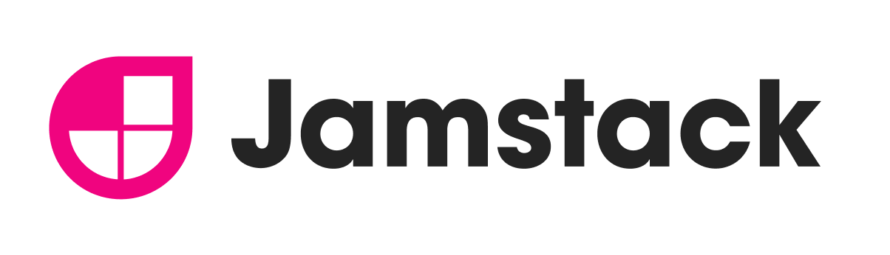
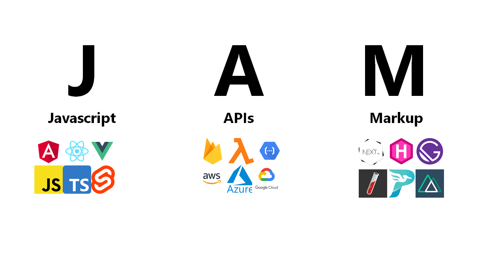

# Jamstack

::: tip JAM ?!?
果...果醬？🥫
:::

簡單來說Jamstack是一種建議的網路架構，為了解決現有的開發痛點與瓶頸，在不同的頁面狀態用不同的工具協作，讓商業化網站無論是使用者體驗還是搜尋引擎優化等議題，都有很好的解方，甚至改善了開發者體驗。

[常見的Jamstaic網站產生工具](https://jamstack.org/generators/)

